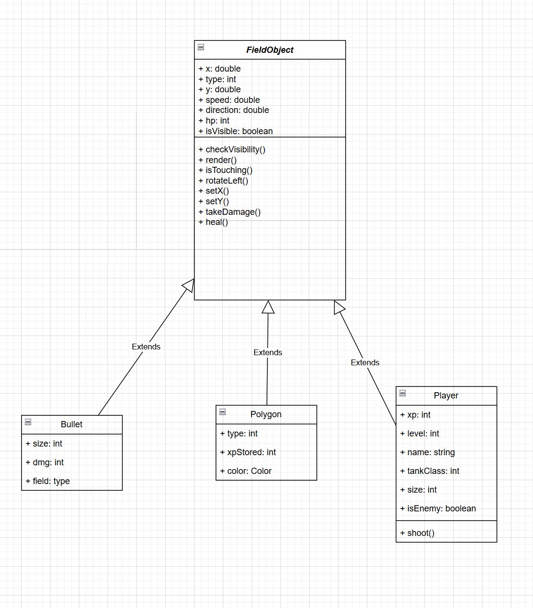
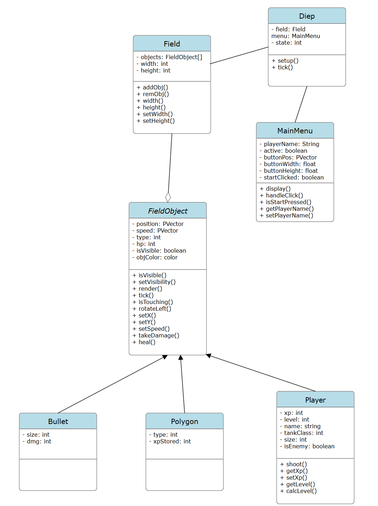

# Group Info
Henry Santos Hendricks and Tasnim Islam
Group name: Diep Thinkers

# Technical Details:
Player will be in a center ~~and a map object with reflect the movement of the player. To keep all other objects consistent with the movement of the player the vector of the map movement will be applied onto all other objects.~~ The player and objects will be kept on screen using the translate() function to emulate a map and will be implemented in the general abstract class.

~Players will have different tank classes:

Twin: shoots two bullets at a time
Sniper: greater FOV and faster bullets
Machine Gun: faster shooting
Flank Guard: shoot in both directions~

# Project Description

(updated) This is a single-player game based on the game Diep.io. A player will roam a limited-size map full of automated enemies, polygons that give XP, and bullets flying everywhere. As a player gains more XP, they gain the option to upgrade their stats, which an edge over theire enemies. Players gain XP by destroying polygons, which deal damage on contact, and by killing enemies that roam the map.

# Intended usage:

(updated) The user will control their circular avatar with the WASD keys for movement and the mouse pointer to aim their gun. When the gun is clicked, the player will shoot, and there will be a cooldown preventing the player from shooting super fast. As the player gains XP, upgrade options will appear, which can be clicked on to give the player an upper edge. Dying results in the loss of all XP.

# Project Design

There will be an abstract class for all movable and renderable objects on the gameplay field, which will be capable of moving, taking/healing damage, turning, detecting each other's touch, becoming visible, and ticking.

At launch, the main menu will display a name input box and a start button. Players can type their name and click the button to begin the game.

Enemies and player objects are the same class; the enemies will be stored in a list, while the player will be a single instance variable.

Players use the WASD keys to move their tank and the mouse to aim and shoot. They will also have to click on buttons for upgrades.

All objects on the field will be stored in the Field class, which contains info like size and also the list of FieldObjects.

Health, weapon damage and rendering will be affected by a player object's type.

Polygons will float around that give xp upon breaking but damage the players on contact.

Enemies will be given basic decision making skills. While the project may be expanded further, this will involve detecting incoming bullets and moving away from them, detecting players and strafe shooting at them, shooting at polygons.~, and selecting class upgrades when they appear.~

(updated) XP system: as players get kills and destroy polygons, they gain xp, which can be used to upgrade the following stats with a menu:
Max Health
Speed
BulletSpeed
Bullet Damage
Player Speed

Plan for bot AI:

If a bot is peaceful (not locked onto a target): heads in a randomised direction for a random amount of timescans every tick for targets. If something comes within view (a certain radius), it selects it as a target and enters one of the battle modes. If the target dies or leaves view, the bot will randomly select a new visible target, or go peaceful if there is no enemy in sight.

Battle modes: the bot will either strafe (go towards the target while moving back and forth perpendicular to the line of sight to the target) or charge (go sraight to the target and shoot). Each mode will last 3-5 seconds before it is randomised again. ~If the bot's health gets too low, it will have a chance to retreat, running away from the target.~ If the bot gets too close, it will retreat from the target.

New UML

# Development Phases/Stages
(updated) Henry is in charge of coding the player movement, making the gun and bullet mechanics work (including touch detection), coding the enemy bot AI, and coding the polygon damage interaction, along with things like a health bar.

Tasnim is in charge of making the main menu, writing some code for the polygons, using matrices to make the coordinate system work so that the player stays in the center of the screen, and writing the upgrade system.

Henry:

- Write boilerplate for FieldObject class to define all functions that objects have to implement + write necessary implemented methods (like moving the object)
- Write Field class to make passing information about the field simpler
- Write boilerplate for Bullet and Player classes to create necessary fields
- Write constructors for FieldObject, Player, and Bullet
- Implement FieldObject functions in Bullet and Player
    - tick()
    - render()
    - isTouching()
- Within tick: for Player, tick will either call enemyTick or userTick
    - Enemy: implement bot AI as described
    - Player: track mouse with gun, detect if shooting
    - Both: detect bullet collision
- Within tick: Bullet will just move in their direction, and if they hit something that is not on their team, they deal damage to it
- Write code to make player death and spawn objects
- Write health bar code

# Intended pacing:

Pacing schedule:

May 27: finish abstract FieldObject class
May 28: finish Bullet class
May 29: finish Polygon class
May 30: finish Player class
June 1: Finish upgrade system
